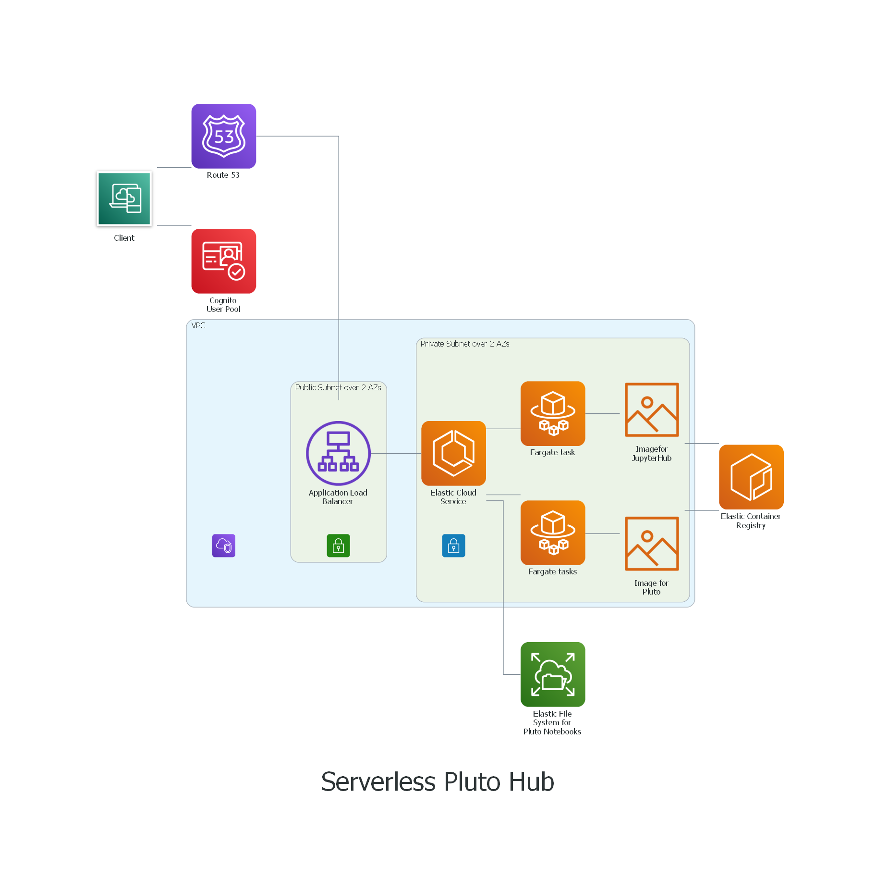

# Serverless JupyterHub

This repository is intended for researchers who wish to provide their group with a Jupyter or Pluto environment. The environment provides access to group specific tools and shared, read-only data. This data would typically be images used for testing algorithms, raw experimental data, course material for advanced students, etc.

Starting points are: 
* the [Application Load Balancer example](https://github.com/aws-samples/aws-cdk-examples/tree/master/python/application-load-balancer), under an [Apache 2.0 License](https://github.com/aws-samples/aws-cdk-examples/blob/master/LICENSE)
* the [Fargate Load Balanced Service example](https://github.com/aws-samples/aws-cdk-examples/tree/master/python/ecs/fargate-load-balanced-service), under an [Apache 2.0 License](https://github.com/aws-samples/aws-cdk-examples/blob/master/LICENSE)

This work is heavily based on the [Jupyter ECS Service CDK project](https://github.com/avishayil/jupyter-ecs-service), under an [Apache 2.0 License](https://github.com/sebranchett/serverless-jupyter-python/blob/main/LICENSE). See also [Avishay Bar's blog post](https://avishayil.medium.com/serverless-jupyter-hub-with-aws-fargate-and-cdk-2160154187a1).

The adaptation for Pluto is inspired by [plutohub-juliacon2021](https://github.com/barche/plutohub-juliacon2021) (no license supplied) and [pluto-on-jupyterlab](https://github.com/pankgeorg/pluto-on-jupyterlab), under an [Unlicense license](https://github.com/pankgeorg/pluto-on-jupyterlab/blob/master/LICENSE) and adapts this [Pluto server](https://github.com/fonsp/pluto-on-jupyterlab), under an [Unlicense license](https://github.com/fonsp/pluto-on-jupyterlab/blob/master/LICENSE).

[This blog](https://faun.pub/accessing-efs-as-a-non-root-user-inside-ecs-container-using-efs-access-point-74bcd9eff04f) was particularly helpful for connecting AWS ECS and AWS EFS.

The adaptations and original work in this repository are provided under an [Apache 2.0 License](LICENSE).

## Architecture

This architecture uses serverless services in order to remove the need from managing servers. EFS is used as shared, persistent storage for storing data and the Jupyter and Pluto notebooks.



The code in this repository can be used to create a set of two AWS CloudFormation templates: the FrameStack arranges the connections between an Amazon VPC (Virtual Private Cloud) and the outside world; the HubStack defines an Amazon ECS (Elastic Cloud Service) that manages a JupyterHub server and single user JupyterLab servers.

## Pre-requisites

- An AWS account with aws-cdk set up on your local machine. See [Setting up the environment](https://github.com/sebranchett/ec2-instance-python#setting-up-the-environment)
- Python 3.6 or later with requirements installed. See [Using this example](https://github.com/sebranchett/ec2-instance-python#using-this-example)
- [Domain name](https://docs.aws.amazon.com/Route53/latest/DeveloperGuide/getting-started.html) managed with a [public hosted zone](https://docs.aws.amazon.com/Route53/latest/DeveloperGuide/AboutHZWorkingWith.html) on AWS Route 53.
  Please collect this information and fill the `config.yaml` file with the hosted zone name and hosted zone id from Route 53.
- [AWS managed certificate](https://docs.aws.amazon.com/acm/latest/userguide/gs-acm-request-public.html), [DNS validated](https://docs.aws.amazon.com/acm/latest/userguide/dns-validation.html) for your domain name.
  Please collect the ARN of your certificate and add it to the `config.yaml` file.
  
  *WARNING:* Validating a certificate can take 30 minutes to hours! Validation will time out after 72 hours.
  
  If it takes longer than 30 minutes, make sure that your Registered domain's 'Name servers' are those named in the Hosted Zone's 'NS' record. [See here](https://stackoverflow.com/a/68703299/13237339).
- A cognito user pool. If you do not yet have a suitable user pool, you can use the separate stack in the `prerequisites` folder to create one. Please collect the UserPool ID and add it to the `config.yaml` file.
- [Docker Desktop](https://docs.docker.com/desktop/), to create the JupyterHub and the single user images.
- A private repository on Amazon Elastic Container Registry (ECR), in the same region you want your infrastructure. This repository should contain a JupyterHub image. See the README file in hub_docker directory.

  You can find the ARN of your image repositories using the command line:
  ```
  aws ecr describe-repositories
  ```
  Please add this ARN and the image tag to the `config.yaml` file.
- A private repository on Amazon Elastic Container Registry (ECR), in the same region you want your infrastructure. This repository should contain a singe user JupyterLab image, optionally with Pluto extension. See the README file in single_use_docker directory.

  You can find the ARN of your image repositories using the command line:
  ```
  aws ecr describe-repositories
  ```

  Please add this ARN and the image tag to the `config.yaml` file.

## Users
The CDK HubStack stack will provision the jupyter administrator user(s) according to the list provided in the hub_docker/admins file. A list of allowed (non-admin) users can be specified in a hub_docker/allowed_users file, see example file provided.

If you wish to add or remove users, or change their status, edit the allowed_users and admin files. You will then need to destroy the HubStack and then redeploy it. Do not perform user administration in JupyterHub. HubStack manages not only the users, but also their storage.

**Note:**
Destroying the HubStack will not destroy the permanent EFS storage. Destroying the FrameStack will destroy the EFS storage, if you have set `efs_policy: 'DESTROY'` in the `config.yaml` file.

## Security

Inherited from Avishay Bar.
- You should configure the admin user temporary password on the `config.yaml` file.
- Authentication to the Jupyter hub is done by AWS Cognito user pool. When a user is logging in to the system, a user directory is automatically created for them.
- Jupyter `Shutdown on logout` is activated, To make sure that ghost processes are closed.
- ECS containers are running in non-privileged mode, according to the docker best practices.
- During the deployment time, the cdk stack will try to determine your public ip address automatically using `checkip.amazonaws.com`.
  Then, it would add only this ip address to the ingress rules of the security group of the public load balancer.
- TLS termination are being done on the application load balancer using a SSL certificate generated on the deployment time by CDK, with DNS record validation on the configured hosted zone.
- Elastic File System is encrypted with a CMK generated by AWS KMS. Key policy is restricted to the account identities.
